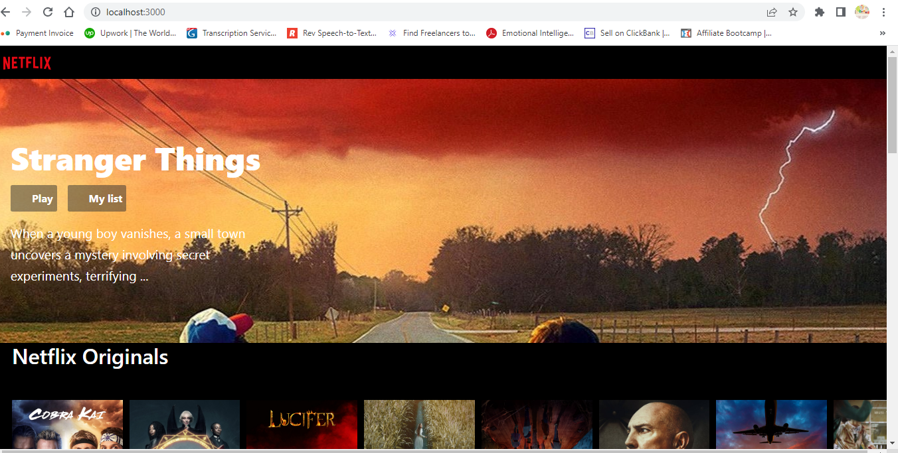
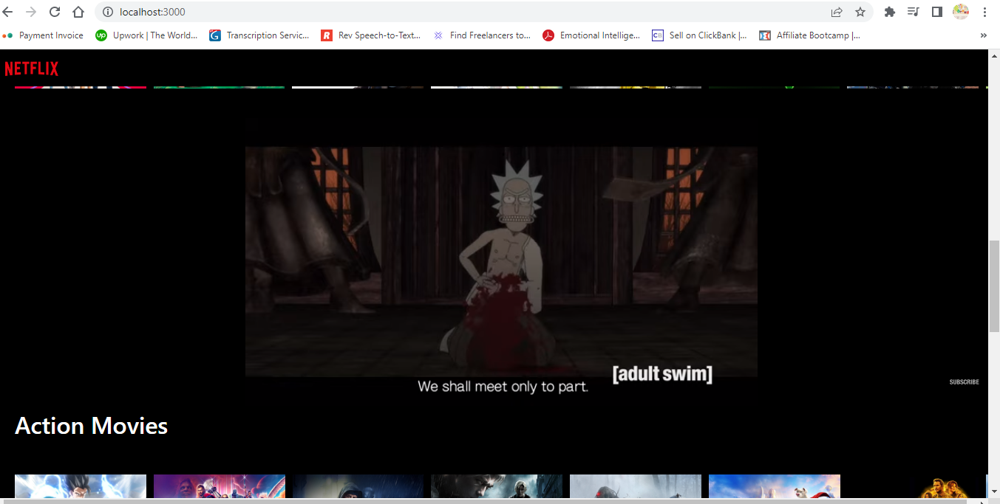
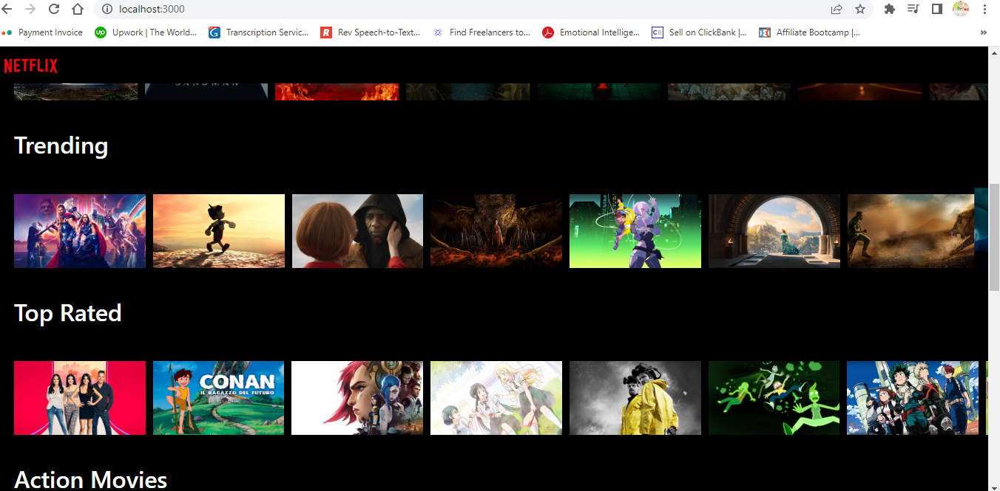

# Netflix Clone

This project was bootstrapped with [Create React App](https://github.com/facebook/create-react-app).

## An Overview of the project:
 
 **This project aims at cloning some of the frontend features of Netflix using one of the most popular external
 api service [The Movie DataBase API(TMDB Api)](https://developers.themoviedb.org/3/getting-started/introduction)
 that provides free data and information on various movies**

<div>
    <div style='margin-top:100px'>
    
    </div>
    <div style='margin-top:100px'>
        
    </div>
    <div style='margin:100px 0'>
        
    </div>
</div>

 

## To run this Project

```
- git clone [movies-app](https://github.com/Kingsley-Opara/MovieApp.git)
- cd movies-app

```
### Run the following commands
```js
- npm install/npm i (To install all the required dependencies)
- npm start 
- To run the development server on port 3000  

```